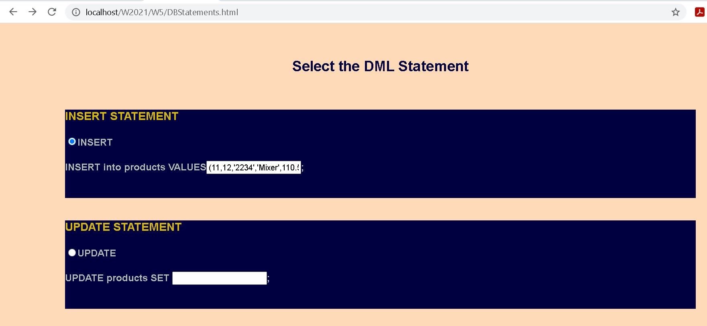
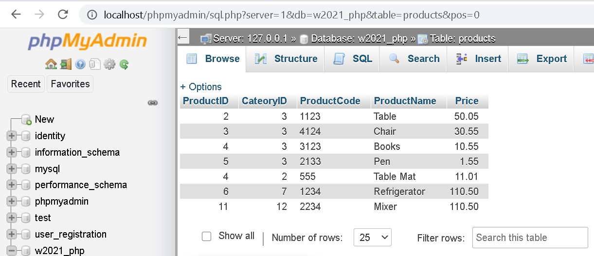
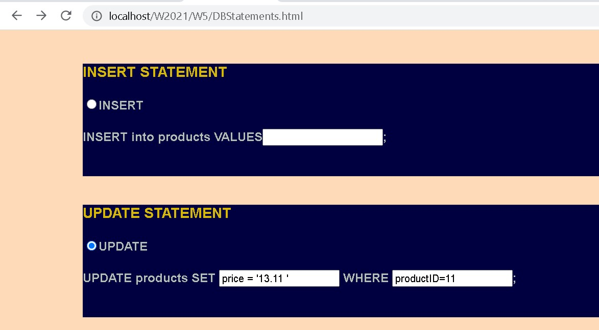
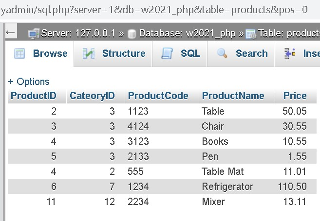
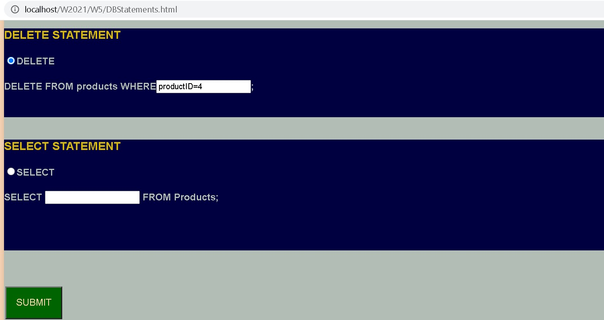
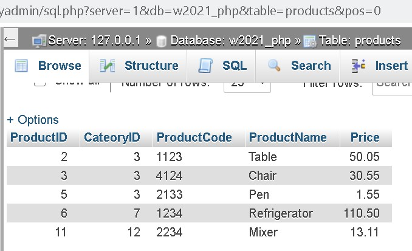
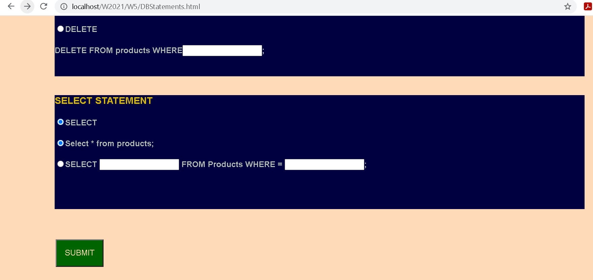
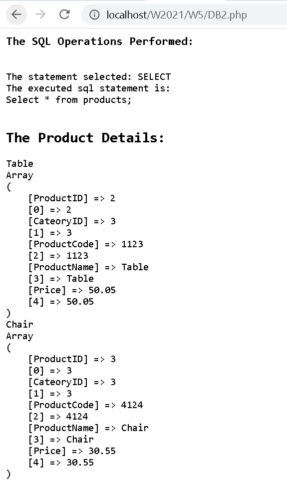

# Shelcy Shaji Thekkedathu
Software Developer
Canada

# Task : Created a simple app to perform DML statements in a database named products
Used checkboxes, radio buttons, drop down, buttons etc

Perform INSERT, UPDATE, DELETE & SELECT statements in a table named products
Output Screens

# INSERT statement

Format: 

Format: 

# UPDATE statement

Format: 

Format: 

# DELETE statement

Format: 

Format: 

# SELECT statement                       

Format: 

Format:    

